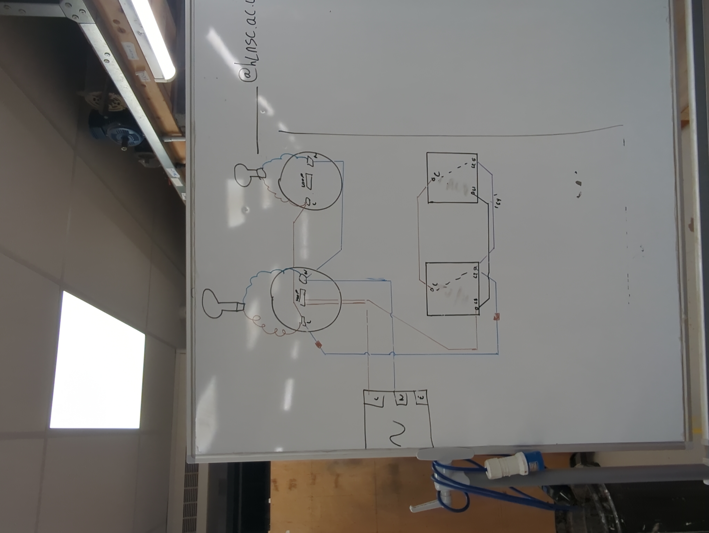
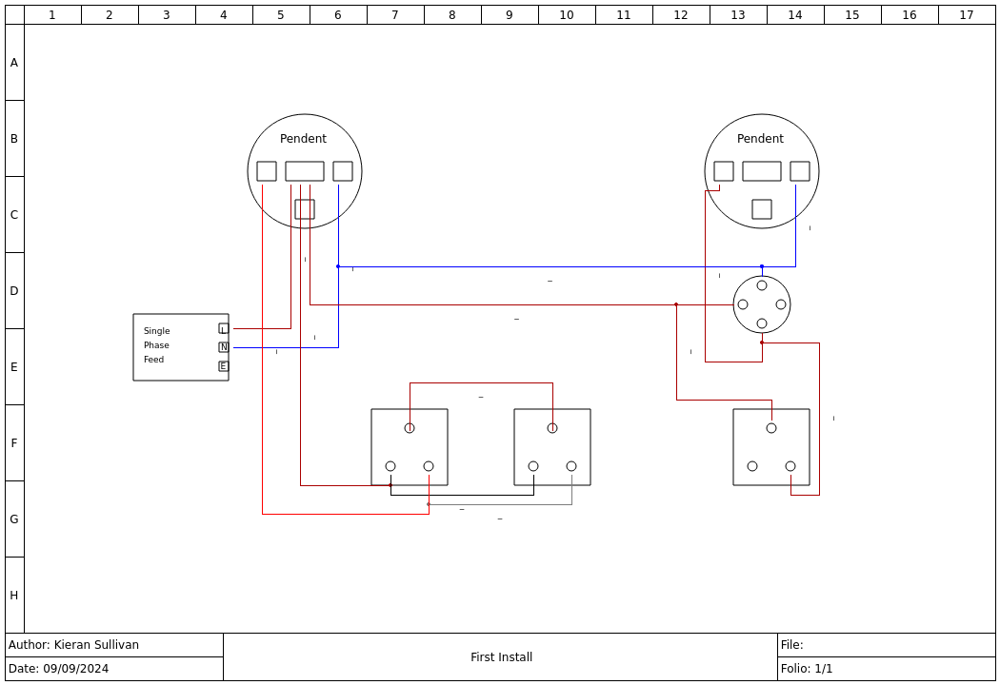

Day 01 - 05/08/24

**Theory**

Ohms Law

V = I * R

Current = I = Amps

Voltage = V = Volts

Resistance = Ω = Ohms

**Practical**

Wired up a plug socket with twin & earth cable.

Built a double switch to turn 2 lights on/off in a synchonised manor, using twin & earth cable, 3 & earth cable, 2 way switches, and pendants.

Trying my hand with Qelectrotech schimatics.

