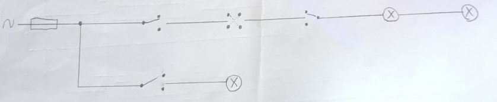
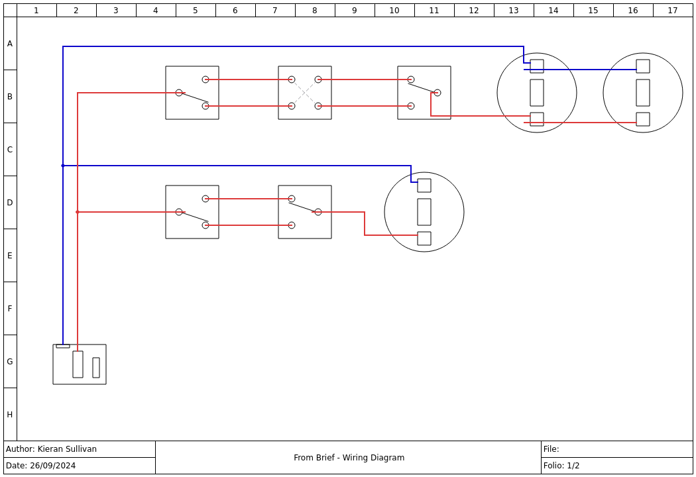
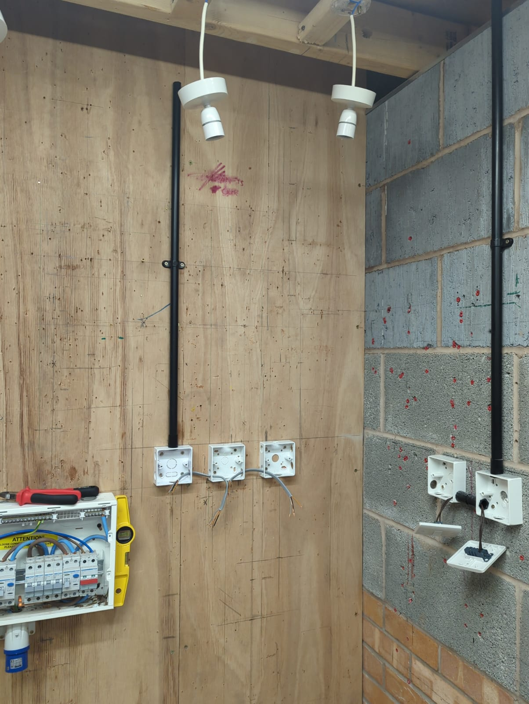
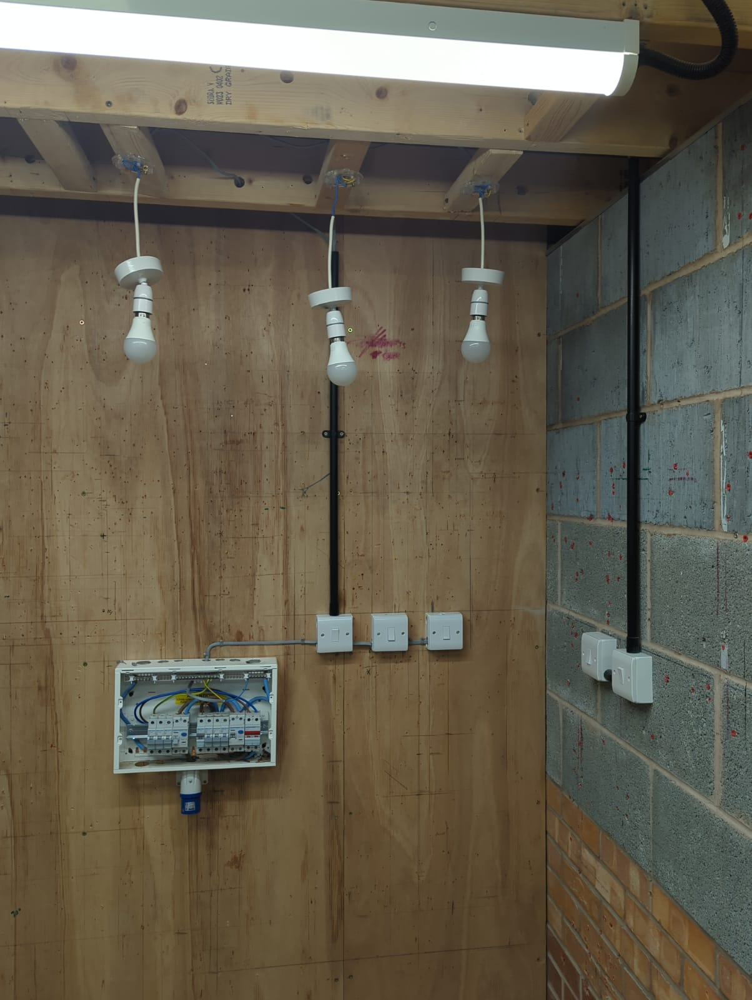

# Module 1 - Brief to Install

**The Brief**

Using 1 x 6A MCB I would like you to design 1 x 3 switch intermediate circuit controlling 2 x pendants and a 2 way controlling 1 light.

**Circuit Diagram**

**Wiring Diagram**

**First Fit**

**Second Fit**
