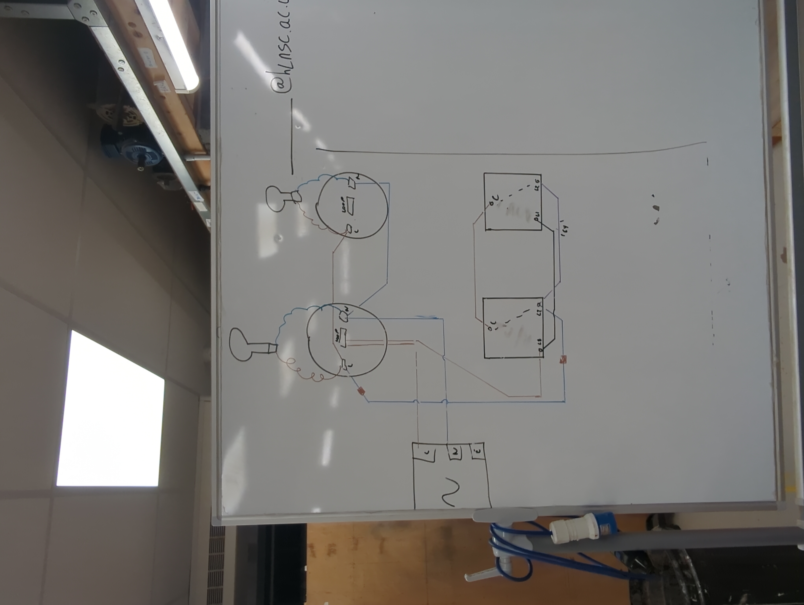
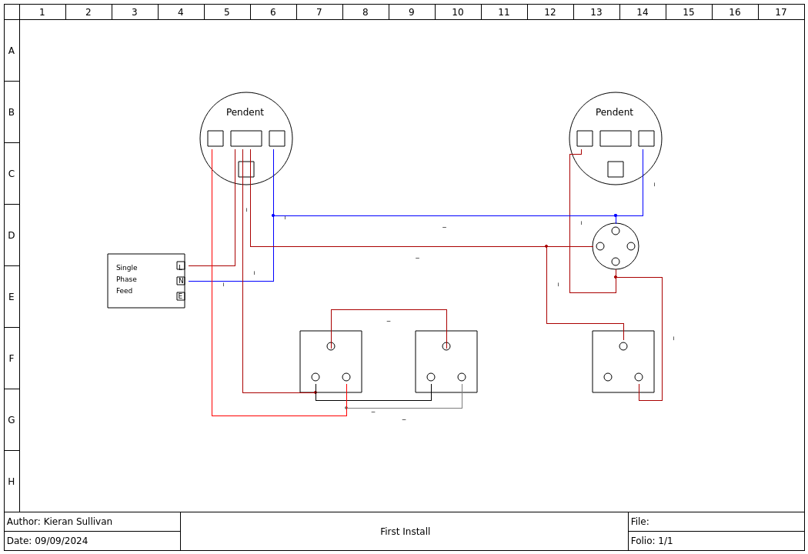

# Module 1 - Practical

**Week 1** - 05/09/24

Wired up a plug socket with twin & earth cable.

Built a double switch to turn 2 lights on/off in a synchonised manor, using twin & earth cable, 3 & earth cable, 2 way switches, and pendants.

Trying my hand with Qelectrotech schimatics.

**Week 2** - 12/09/24

Installs

Conduit Installs

