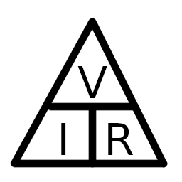
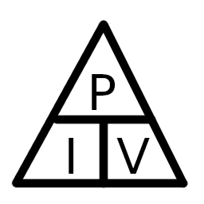

# Module 1 - Theory

**Ohms Law**

V = I * R

Current = I = Amps

Voltage = V = Volts

Resistance = Ω = Ohms

**Power Triangle**

P = V * I

Power = P = Watts

Voltage = V = Volts

Current = I = Amps

# Lighting Circuits

- All points should be assumed to be rated to 100w
- Always install at least two  circuits to prevent total blackout
- Earthing terminals must be provided at all lighting points
- 5 or 6 amp protection is used for domestic installs
- Genrally wired using 1.0mm or 1.5mm cable
  **2 Types of lighting wiring systems**
- 2 Plate system - Single core cables eg conduit + trunking

  - Single pole switches and protective devices MUST be installed in the line conductor ONLY.
  - For Edison Screw (ES) lamp holders the line conductor MUST be connected to the center contact of the lamp holder.
- 3 Plate system - Multi-core cable eg domestic installs using twin and earth

# Socket Circuits

Final circuits using BS1363 socket outlet
Minimum line conductor cross-section area (mm squared)

| Type of circuit | Overcurrent protective device rating (A) | Copper conductor thermo-plastic or thermo-setting insulated cables | Copper conductor material insulated cables | Maximum floor area |
| :---------------: | :----------------------------------------: | :------------------------------------------------------------------: | :------------------------------------------: | :------------------: |
|    A1   Ring    |                 30 or 32                 |                                2.5                                |                    1.5                    |        100        |
|    A2 Radial    |                 30 or 32                 |                                 4                                 |                    2.5                    |         75         |
|    A3 Radial    |                    20                    |                                2.5                                |                    1.5                    |         50         |

# PVC Cables

2 Main forms:

**Thermo-plastic & Thermo-setting**

**PVC Single Core 6491X**
    - 1.0mm + stranded or solid core
    - Requires additional mechanical protection eg conduit or trunking
    - Genrally found in commercial, inductrial and agricultural environmnets
    - Avialable in a veriety of different colors.

**PVC insulated, PVC sheathed flat twin and CPC 6242Y**
    - 1mm, 1.5mm and 2.5mm solid conductors, larger are genrally stranded
    - Sheating provides mechanical protection so can be clipped directly to surface.
    - PVC insulated conductors and uninsulated CPC conductors.
    - Flat 3 core and CPC (6243Y) is available in single core and CPC.
    - Genrally used for domestic installs.

**PVC insulated, PVC sheathed flexiable cable 3092Y & 3093Y**
    - 0.5mm+
    - Made of many fine strands making it very flexible.
    - Sheathing provides mechanical protection.
    - 2 and 3 cores are common but avaialable with many cores.
    - Genrally used for portable applications, sockets, lighting points, pendants.
    - Make sure to twist the ends to avoid "Whiskers" (odd strands of copper)

**Thermo-plastic PVC**
    - Thermoplastic PVC or thermo-setting insulated non-sheathed cable:
        BS7211 & BS7919
    - Normally used in conduit, trunking and cable ducting
    - Cables run in PVC conduit should not go above 70 degrees c

# SWA Steel Wire Armoured Cable

**Glands**
    Indoor glands
    Outdoor glands - Always use a shroud outside

**Clips**
    - Various avaialable 
    - SWA can be installed on a wall using a cleat
    - installed in tray, wire raps my be used
    - Always follow BS7671

# Single Phase Incoming Power Supply (up to 100A)

1. Distrobuters Cut Out (80A or 100A)
2. Electricity Meter
3. Meter Tails
4. Electicity Isolator Switch
5. Optiona seperate RCD for solar etc

**Distrobutors Cut Out**

BS88
Has tamper proof seal (Do not remove)
**Electricity meter**

Also has tamper proof seal (Do not remove)
**Meter Tails**

25mm squared CSA conductors between meter and consumer unit.
**Electricity Isolator Switch**

Used to isolate electricity supply

# Fault Protection

A consumer unit must be able to handle:

- Overcurrent Conditions
- Earth Leakage Current Conditions
  **Overcurrent**

BS7671 Definition:
A current exceeding the rated value. For conductors the rated value is the current carrying capacity.

Overcurrent is subdevided into:

- Overload Current
  BS7671 Definition:
  An overcurrent occuring in a circuit which is electrically sound.
- Fault Current
  BS7671 Definition:
  A current resulting from a fault.
  **Earth Leakage Current**

BS7671 Definition:
Electric current appeaaring in a protective conductor such as leaking current or electric current resulting from an insulation fault.

**Fault Current**

BS7671 Definition:
An overcurrent resulting from a fault of negledgable inpeedance between live conductors haveing a difference in potential under normal operating conditions.

# Isolator Switches

Double pole isolator switches

In consumer unit 1 manually operated and 1 encorporating an RCD

RCD protects against fault currents.
